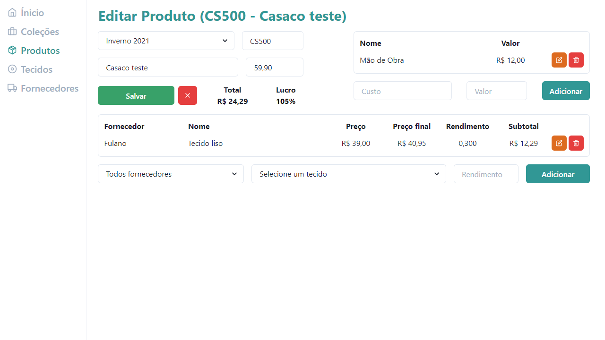

# **:moneybag: FabriCosts**

A simple costs and profit manager for a textile industry.

## :bulb: Objective
This project focus to be a kind of dashboard, with costs, fabrics, products, providers and groups/collections managing.

## :heavy_check_mark: Features
 ### :floppy_disk: Server
  - Products
 - Costs
 - Providers
 - Fabrics
 - Groups / Collections

 ### :computer: Website
 - Products
 - Costs
 - Providers
 - Fabrics
 - Groups / Collections

## :art: Layout
<h1 align="center">
    
    
</h1>

## **:wrench:  Technologies**

 ### :floppy_disk: Server
 - [Node.js][node]
 - [Express][express]
 - [Knex][knex]
 - [TypeScript][typescript]
 - [Celebrate][celebrate]

 ### :computer: Website
 - [React][react]
 - [TypeScript][typescript]
 - [Chakra][chakra]
 - [Axios][axios]
 - [SWR][swr]
 - [Unform][unform]

## :books: How to use
:floppy_disk: **Server**
```sh
  # Run the migrations and seeds
  $ cd server
  $ npm run migrate

  # Start the server
  $ npm run dev
  
  # The server will be running on port 3333
```

:computer: **Website**
```sh
  # Start the website
  $ cd web
  $ npm start

  # The website will be running on port 3000
```

## :open_book: How to contribute

1. Make a **fork**.
2. Make a new branch with your changes: `git checkout -b my-feature`
4. Save your changes and make a commit with a cool message: `git commit -m "feat: My new feature"`
5. Send your changes: `git push origin my-feature`
> If a question persists, see [how to contribute in GitHub](https://github.com/firstcontributions/first-contributions)


## :memo: License

This project is under the **MIT License**. See [LICENSE][license] to know more.

---
<h4 align="center">
Made with ❤️ by <a href="https://www.linkedin.com/in/rikelme-griep-b265a51ab" target="_blank">Rikelme Griep</a>
</h4>

<!-- Website Links -->

[node]: https://nodejs.org/
[typescript]: https://www.typescriptlang.org/
[react]: https://reactjs.org
[license]: https://opensource.org/licenses/MIT
[express]: https://expressjs.com/
[knex]: http://knexjs.org/
[chakra]: https://chakra-ui.com/
[axios]: https://github.com/axios/axios
[unform]: https://unform.dev/
[swr]: https://swr.vercel.app/
[celebrate]: https://www.npmjs.com/package/celebrate
